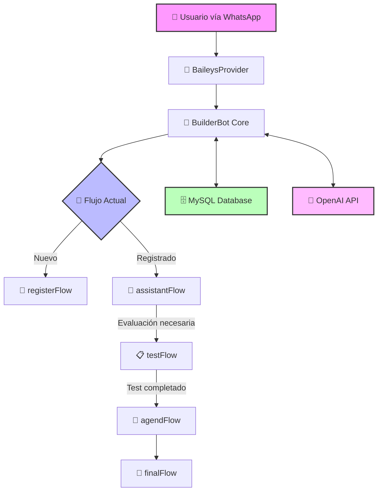

<p align="center">
  
  <h1 align="center">✨ BotPsicología ✨</h1>
  <p align="center">🧠 Asistente Virtual Inteligente para Apoyo Psicológico 🧠</p>
</p>

<p align="center">
  
  
  
  
  
</p>

<p align="center">
  <a href="#-descripción">Descripción</a> •
  <a href="#-características-principales">Características</a> •
  <a href="#-tecnologías">Tecnologías</a> •
  <a href="#-instalación">Instalación</a> •
  <a href="#-uso">Uso</a> •
  <a href="#-arquitectura">Arquitectura</a> •
  <a href="#-contribución">Contribución</a> •
  <a href="#-licencia">Licencia</a>
</p>

---

## 📋 Descripción

**BotPsicología** es un innovador chatbot de WhatsApp diseñado para proporcionar un primer acercamiento y apoyo psicológico a usuarios que podrían necesitar ayuda emocional o mental. Utiliza inteligencia artificial avanzada para:

- 🔍 Realizar evaluaciones psicológicas preliminares
- 🗣️ Ofrecer espacios de escucha y contención mediante IA
- 📊 Aplicar tests psicológicos estandarizados (GHQ-12)
- 📅 Facilitar el agendamiento de citas con profesionales
- 📈 Dar seguimiento al progreso de los usuarios

Este proyecto busca democratizar el acceso a la atención psicológica inicial, sirviendo como puente entre las personas que necesitan ayuda y los profesionales de la salud mental.

## ✨ Características Principales

- 🤖 **Interacción Intuitiva**: Interfaz conversacional natural a través de WhatsApp
- 🧪 **Evaluación Psicológica**: Test GHQ-12 integrado para evaluación inicial
- 🎯 **Clasificación Inteligente**: Categorización de casos según nivel de urgencia
- 📝 **Registro Personalizado**: Sistema de registro de usuarios con historial
- 🔒 **Privacidad Garantizada**: Manejo seguro y confidencial de datos sensibles
- 📊 **Análisis de Datos**: Reportes y estadísticas para profesionales
- 🌐 **Disponibilidad 24/7**: Asistencia automatizada disponible en todo momento
- 🔄 **Seguimiento Continuo**: Monitoreo del progreso y bienestar del usuario

## 🛠️ Tecnologías

| Categoría | Tecnologías |
|-----------|-------------|
| 🔧 **Framework** | BuilderBot (@builderbot/bot v1.2.2) |
| 💬 **Conexión WhatsApp** | Baileys (@builderbot/provider-baileys v1.2.2) |
| 🗄️ **Base de Datos** | MySQL + Prisma ORM (v6.1.0) |
| 🧠 **Inteligencia Artificial** | OpenAI API (v4.77.3) |
| ⚙️ **Backend** | Node.js, Express |
| 🐳 **Contenedorización** | Docker |
| 🧪 **Tests** | Jest |

## 📥 Instalación

### 📋 Requisitos Previos

- 📦 Node.js v16 o superior
- 🗄️ MySQL Server
- 🔑 Cuenta de OpenAI para acceso a API
- 📱 Número de teléfono para WhatsApp Business

### ⚡ Instalación Rápida

```bash
# 1️⃣ Clonar el repositorio
git clone https://github.com/tu-usuario/BotPsicologia.git
cd BotPsicologia

# 2️⃣ Instalar dependencias
npm install
# O si prefieres usar Bun
bun install

# 3️⃣ Configurar variables de entorno
cp .env.example .env
# Edita el archivo .env con tus credenciales

# 4️⃣ Configurar la base de datos
npx prisma migrate dev --name init

# 5️⃣ Iniciar el bot en modo desarrollo
npm run dev
```

### 🐳 Despliegue con Docker

```bash
# Construir la imagen
docker build -t bot-psicologia .

# Ejecutar el contenedor
docker run -d -p 3008:3008 --env-file .env --name bot-psicologia bot-psicologia
```

## 🚀 Uso

### 🔄 Flujo de Interacción del Usuario

1. 👋 **Bienvenida**: El usuario envía un mensaje a través de WhatsApp
2. 📝 **Registro**: El bot solicita información básica para crear el perfil
3. 💬 **Conversación Inicial**: Evaluación preliminar del motivo de consulta
4. 📋 **Test Psicológico**: Realización del cuestionario GHQ-12 si es necesario
5. 📊 **Evaluación de Resultados**: Análisis de las respuestas
6. 📅 **Agendamiento**: Coordinación de cita con profesional según resultados
7. 🔔 **Recordatorio**: Notificación previa a la cita programada
8. 📌 **Seguimiento**: Monitoreo posterior y recomendaciones

### 👩‍💻 Panel de Administración

El proyecto incluye un panel para que los profesionales de psicología puedan:

- 👁️ Visualizar casos asignados
- 📅 Gestionar su disponibilidad
- 📊 Revisar resultados de tests
- 📝 Acceder al historial de interacciones
- 📣 Enviar mensajes programados

## 🏗️ Arquitectura

### 🔄 Flujo del Sistema



### 📂 Estructura de Carpetas

```
BotPsicologia/
│
├── 🗃️ .deleted/              # Archivos eliminados (respaldo)
├── 📂 .git/                  # Repositorio Git
├── ⚙️ .qodo/                 # Configuración del entorno
├── 🖼️ assets/                # Recursos estáticos (imágenes, etc.)
│   ├── 🖼️ logo.png           # Logo del proyecto
│   └── 📱 bot.qr.png         # Código QR para la conexión
│
├── 💾 bot_sessions/          # Sesiones de WhatsApp almacenadas
├── 📦 node_modules/          # Dependencias de Node.js
├── 🗄️ prisma/                # Configuración y migraciones de Prisma
│   └── 📜 schema.prisma      # Esquema de la base de datos
│
├── 📂 src/                   # Código fuente
│   ├── 📜 app.js             # Punto de entrada principal
│   ├── 📂 flows/             # Flujos de conversación
│   │   ├── 📜 flows.js       # Definición de flujos
│   │   ├── 📂 agend/         # Gestión de agendamiento
│   │   ├── 📂 assist/        # Asistencia con IA
│   │   ├── 📂 register/      # Registro de usuarios
│   │   └── 📂 tests/         # Procesamiento de tests
│   │
│   ├── 📂 openAi/            # Integración con OpenAI
│   └── 📂 queries/           # Consultas a la base de datos
│
├── 🐳 Dockerfile             # Configuración de Docker
├── 📝 README.md              # Documentación del proyecto
└── 📦 package.json           # Dependencias y scripts
```

## 📚 Modelo de Datos

El proyecto utiliza Prisma ORM con MySQL y tiene las siguientes tablas principales:

| Tabla | Descripción |
|-------|-------------|
| 👤 **informacionUsuario** | Datos personales y de contacto |
| 📋 **ghq12** | Respuestas y resultados del test GHQ-12 |
| 📊 **tests** | Otros test psicológicos aplicados |
| 🏥 **consultorio** | Información de espacios de atención |
| 👩‍⚕️ **practicante** | Datos de los profesionales disponibles |
| 📅 **cita** | Registro de citas programadas |
| 📝 **notas** | Observaciones de seguimiento |

## 🌟 Características Avanzadas

### 🧠 Inteligencia Artificial

El bot utiliza modelos avanzados de OpenAI para:

- 💬 Mantener conversaciones empáticas y naturales
- 🔍 Detectar patrones emocionales en el lenguaje
- 📊 Evaluar la severidad de los casos
- 📝 Generar resúmenes para los profesionales
- 🎯 Personalizar recomendaciones según el perfil

### 📱 WhatsApp como Plataforma

Ventajas de utilizar WhatsApp como medio de interacción:

- 🌐 Amplia adopción y familiaridad
- 🔒 Encriptación de extremo a extremo
- 📲 Accesibilidad desde cualquier dispositivo
- 🔔 Sistema de notificaciones integrado
- 🖼️ Soporte para multimedia (imágenes, audios)

## 🤝 Contribución

¡Agradecemos tu interés en contribuir al proyecto! Puedes participar de varias formas:

1. 🐛 **Reportar Bugs**: Abre un issue describiendo el problema
2. 💡 **Sugerir Mejoras**: Comparte tus ideas para nuevas funcionalidades
3. 🧪 **Escribir Tests**: Ayúdanos a mejorar la calidad del código
4. 📚 **Mejorar Documentación**: Corrige o amplía la documentación
5. 💻 **Contribuir Código**: Sigue estos pasos:

```bash
# 1️⃣ Haz un fork del repositorio
# 2️⃣ Crea tu rama de características
git checkout -b feature/nueva-funcion

# 3️⃣ Haz commit de tus cambios
git commit -m '✨ Añade nueva función de seguimiento'

# 4️⃣ Sube tus cambios
git push origin feature/nueva-funcion

# 5️⃣ Abre un Pull Request
```

### 📋 Guía de Estilo

- 🧹 Utiliza ESLint para mantener la consistencia del código
- 📝 Documenta las nuevas funciones y cambios
- 🧪 Añade tests para las nuevas características
- 🔄 Mantén las dependencias actualizadas

## ⚖️ Consideraciones Éticas

Este proyecto se desarrolla con las siguientes consideraciones:

- 🔒 **Privacidad**: Cumplimiento de las regulaciones de protección de datos
- ⚠️ **Limitaciones**: Aclaración de que no sustituye la atención profesional
- 🚨 **Detección de Crisis**: Protocolo para casos de emergencia
- 👩‍⚕️ **Supervisión**: Revisión por profesionales calificados
- 📊 **Transparencia**: Claridad sobre el uso de IA en el asistente

## 📅 Hoja de Ruta (Roadmap)

### 🚀 Próximas Funcionalidades

- [ ] 🌐 Soporte multilingüe
- [ ] 🎙️ Análisis de mensajes de voz
- [ ] 📊 Dashboard para visualización de datos
- [ ] 🔔 Sistema de alertas para casos urgentes
- [ ] 📱 Aplicación web complementaria
- [ ] 📝 Incorporación de más tests psicológicos
- [ ] 🤖 Mejora del modelo de IA con entrenamiento específico

## 📞 Soporte

Si tienes preguntas o necesitas ayuda con la implementación:

- 📧 **Email**: soporte@botpsicologia.com
- 💬 **Discord**: [Servidor de la Comunidad](https://discord.gg/botpsicologia)
- 🐦 **Twitter**: [@BotPsicologia](https://twitter.com/botpsicologia)

## 📜 Licencia

Este proyecto está bajo la [Licencia ISC](LICENSE). 

---

<p align="center">
  Desarrollado con 💙 por el equipo de BotPsicología
</p>

<p align="center">
  <a href="#-descripción">⬆️ Volver arriba</a>
</p>